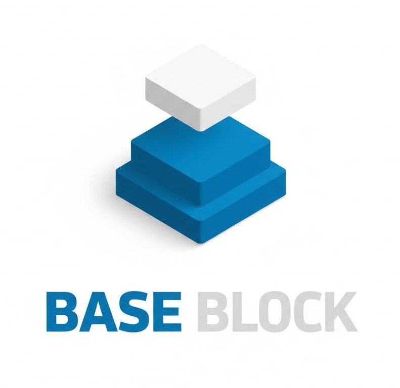

<div align="center">
  
  
  # Base Block
  
  ### build blocks. Earn Crypto. Built on Base.
  
  <p>
    <a href="https://base-tower.vercel.app/">
      
    </a>
    <a href="#roadmap">
      
    </a>
  </p>
  
  <p>
    
    
    
  </p>
</div>

</div>

<br />

## 💡 What is Base Block?

Base Block is a **blockchain-powered arcade game** that rewards players for their skills. Jump through endless platforms, collect rewards, and climb the global leaderboard—all while earning **real crypto tokens** on the Base network.

### ✨ Why Base Block?

- **Play & Earn**: Convert your gaming skills into cryptocurrency rewards
- **Low Fees**: Built on Base (Ethereum L2) for instant, affordable transactions  
- **Farcaster Native**: Seamlessly integrated with your Farcaster identity
- **Fair Competition**: Transparent, on-chain scoring and rewards

<br />

## 🎮 Game Features

<table>
<tr>
<td width="50%">

### 🎮 Core Gameplay

- Auto-jumping character with smooth physics
- **Tilt** or **Touch** controls for mobile
- Vertical scrolling with dynamic difficulty
- Score-based reward system
- Collectible power-ups and candy

</td>
<td width="50%">

### 💰 Crypto Rewards

- Earn **DEGEN**, **NOICE**, and **PEPE** tokens
- 3 gift boxes every 12 hours
- Higher scores = Better rewards
- On-chain verified claims
- Auto-reset reward timer

</td>
</tr>
</table>

<br />

### 🎯 Game Mechanics

| Element | Description |
|---------|-------------|
| 🟪 **Normal Platforms** | Standard safe landing spots |
| 🔴 **Destructive Platforms** | Break after one use—plan your jumps! |
| 👻 **Invisible Platforms** | Moving platforms that require precision |
| 🍬 **Candy Collectibles** | Instant points + super jump boost |
| 👾 **Enemy Obstacles** | Avoid contact or it's game over |

### 📈 Difficulty Levels

```
Easy (0-50)      → Safe platforms, slow pace
Normal (51-100)  → Mixed challenges, faster movement  
Hard (101-200)   → More hazards, quick reflexes needed
Extreme (200+)   → Ultimate challenge for pros
```

<br />

## 🔗 Blockchain Integration

### 🎱 Gift Box Reward System

Earn cryptocurrency by playing! Each gift box contains random token rewards:

<table>
<tr>
<th>Token</th>
<th>Reward Range</th>
<th>Win Probability</th>
</tr>
<tr>
<td>🪙 <strong>DEGEN</strong></td>
<td>100 - 500 tokens</td>
<td rowspan="3">

Score-based:
- `< 500`: 10% 🟡
- `500-999`: 30% 🟠  
- `1,000-1,999`: 50% 🟢
- `2,000-2,999`: 70% 🔵
- `3,000-4,999`: 80% 🟣
- `5,000+`: 90% 🏆

</td>
</tr>
<tr>
<td>🎉 <strong>NOICE</strong></td>
<td>50 - 200 tokens</td>
</tr>
<tr>
<td>🐸 <strong>PEPE</strong></td>
<td>10,000 - 50,000 tokens</td>
</tr>
</table>

**How it works:**
1. 🎮 Play a game and beat your high score
2. 🎁 Open your gift box to reveal rewards
3. 💰 Claim tokens instantly to your wallet
4. 🔄 3 gift boxes every 12 hours

<br />

### 📦 Smart Contracts

**Built on Base** (Ethereum L2)

| Contract | Address | Purpose |
|----------|---------|----------|
| **MiniGame** | `0x345BC...fb31C` | Game sessions & score verification |
| **baseBlock** | `0xd1370...c3506` | Token rewards & gift box claims |

**Key Features:**
- ⚡ Fast, low-cost transactions on Base L2
- 🔐 Cryptographic signature verification
- 🚫 Anti-replay attack protection  
- 🎮 Period-based reward limits (12-hour windows)

<br />

## 🏆 Leaderboards & Competition

### Global Rankings

**Two Leaderboard Types:**

<table>
<tr>
<td width="50%">

#### 📅 Season Leaderboard
- Updates in real-time  
- Resets periodically
- Fair competition for new players
- Season-based rewards

</td>
<td width="50%">

#### 🏆 All-Time High
- Your best score ever
- Hall of fame for legends  
- Never resets
- Permanent bragging rights

</td>
</tr>
</table>

**Leaderboard Features:**
- 🔄 Real-time score updates
- 🖼️ Farcaster profile pictures
- 🌍 Global competition  
- 📊 Transparent, on-chain verification

<br />

## 📱 Where to Play

### 🟬 Farcaster Mini App (Live Now)

Play directly in your Farcaster app:

1. Open Farcaster mobile app
2. Go to **Mini Apps**
3. Search **"Base Block"**  
4. Launch & play instantly!

**Features:**
- 🔗 Native Farcaster integration
- 👛 Seamless wallet connection
- 👥 Social features & sharing
- ✅ Verified player identities

### 🌐 Web Version (Coming Soon)

Join the waitlist: **[base-jump-five.vercel.app](https://base-tower.vercel.app/)**

**What's Coming:**
- 💻 Browser-based gameplay
- 📱 Desktop & mobile support  
- 👛 MetaMask, Coinbase Wallet, WalletConnect
- 🔄 Cross-platform progress sync

<br />

## 💻 Tech Stack

<table>
<tr>
<td valign="top" width="33%">

### 🎨 Frontend
- **Next.js 14** (React)
- **Phaser 3** (Game Engine)
- **Tailwind CSS** (Styling)
- **Framer Motion** (Animations)

</td>
<td valign="top" width="33%">

### ⚙️ Backend
- **Next.js API Routes**
- **MongoDB** (Database)
- **Upstash Redis** (Cache)
- **Signature Auth** (Security)

</td>
<td valign="top" width="33%">

### ⛓️ Blockchain
- **Base L2** (Network)
- **Wagmi** (Wallet Hooks)
- **Reown AppKit** (WalletConnect)
- **Solidity** (Smart Contracts)

</td>
</tr>
</table>

<br />

## 🚀 Quick Start

### Prerequisites

```bash
node >= 18.0.0
pnpm >= 8.0.0
```

### Installation

```bash
# Clone repository
git clone https://github.com/your-username/base-jump.git
cd base-jump

# Install dependencies
pnpm install

# Create .env.local file with required variables
cp .env.example .env.local

# Run development server
pnpm dev
```

Visit `http://localhost:3000` 🎉

### Environment Setup

Create `.env.local` with:

```env
MONGODB_URI=your_mongodb_uri
NEXT_PUBLIC_BASE_JUMP_ADDRESS=0xYourContractAddress
NEXT_PUBLIC_REOWN_PROJECT_ID=your_reown_id
API_SECRET_KEY=your_secret
SERVER_PRIVATE_KEY=your_private_key
```

<details>
<summary><strong>View all environment variables</strong></summary>

```env
# Database
MONGODB_URI=your_mongodb_connection_string

# Smart Contracts
NEXT_PUBLIC_BASE_JUMP_ADDRESS=0xd137015EE799D0224AF58940D21d0684B32c3506

# Token Contracts (Base Network)
NEXT_PUBLIC_DEGEN_TOKEN_ADDRESS=0x4ed4e862860bed51a9570b96d89af5e1b0efefed
NEXT_PUBLIC_NOICE_TOKEN_ADDRESS=0x9cb41fd9dc6891bae8187029461bfaadf6cc0c69
NEXT_PUBLIC_PEPE_TOKEN_ADDRESS=0x52b492a33e447cdb854c7fc19f1e57e8bfa1777d

# Security
API_SECRET_KEY=your_api_secret_key
NEXT_PUBLIC_API_SECRET_KEY=your_public_api_key
SERVER_PRIVATE_KEY=your_server_private_key

# Wallet Connect
NEXT_PUBLIC_REOWN_PROJECT_ID=your_reown_project_id

# App Configuration
NEXT_PUBLIC_URL=http://localhost:3000

# Redis Cache (Optional)
KV_REST_API_URL=your_redis_url
KV_REST_API_TOKEN=your_redis_token
```

</details>

<br />

## 🔌 API Reference

<details>
<summary><strong>View API Endpoints</strong></summary>

### Game Management

```
POST   /api/start-game        → Initialize game session
POST   /api/submit-score      → Submit score after game
GET    /api/user-stats        → Player statistics
```

### Leaderboards

```
GET    /api/leaderboard       → Current season rankings
GET    /api/ath-leaderboard   → All-time high scores
```

### Rewards & Gift Boxes

```
POST   /api/claim-gift-box    → Claim token rewards
GET    /api/claim-gift-box?stats=true         → Check remaining claims
GET    /api/claim-gift-box?userAddress=0x...  → User availability
```

### Waitlist

```
POST   /api/waitlist          → Join web waitlist
GET    /api/waitlist          → Get waitlist stats
```

</details>

<br />

## 🔒 Security

<table>
<tr>
<td width="50%">

**Authentication**
- ✅ Cryptographic signatures
- 🚫 Replay attack prevention  
- ⏱️ Rate limiting
- 🔐 Environment-based secrets

</td>
<td width="50%">

**Smart Contracts**
- 🛡️ OpenZeppelin patterns
- 🔑 Access control
- ✅ Signature verification
- 🚫 Re-entrancy protection

</td>
</tr>
</table>

<br />


## 🤝 Contributing

Contributions are welcome! Here's how:

```bash
# Fork & clone
git clone https://github.com/your-username/base-jump.git

# Create feature branch
git checkout -b feature/your-feature

# Commit changes
git commit -m "Add: your feature description"

# Push & create PR
git push origin feature/your-feature
```

**Ways to contribute:**  
🐛 Bug reports • 💡 Feature ideas • 🔧 Code improvements • 📝 Documentation

<br />


## 🗺️ Roadmap

```diff
✅ Q1 2025
+ Core game mechanics
+ Farcaster Mini App
+ Blockchain rewards
+ Global leaderboards

⏳ Q2 2025
- Web version launch
- NFT character skins
- Tournament mode
- Mobile apps (iOS/Android)

🔮 Q3 2025
- Social features & guilds
- Seasonal events
- Multi-chain support
- NFT marketplace

💡 Q4 2025
- Esports tournaments
- Creator tools & API
- Staking mechanism
```

<br />

## 💬 Community & Support

<table>
<tr>
<td align="center" width="33%">

### 👥 Community
[Discord](https://discord.gg/baseBlock) • [Twitter](https://twitter.com/baseBlockgame)

</td>
<td align="center" width="33%">

### 🐛 Support  
[Report Issues](https://github.com/your-username/base-jump/issues)

</td>
<td align="center" width="33%">

### 📚 Docs
[Documentation](https://docs.baseBlock.game)

</td>
</tr>
</table>

<br />

---

<div align="center">

## 🚀 Ready to Play?

<p>
  <a href="https://farcaster.xyz/~/mini-apps/launch?domain=base-jump-five.vercel.app">
    
  </a>
  <a href="https://base-tower.vercel.app/">
    
  </a>
</p>

<br />

**Built with ♥️ on Base**

MIT License • [View License](LICENSE)

<br />

<sub>Special thanks to Base, Farcaster, Phaser, OpenZeppelin, and Vercel</sub>

---

⭐️ **Star this repo if you enjoy Base Block!** ⭐️

</div>
# Base_Towerr_new
